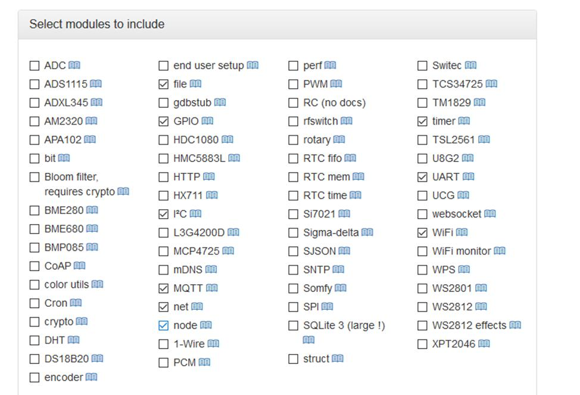
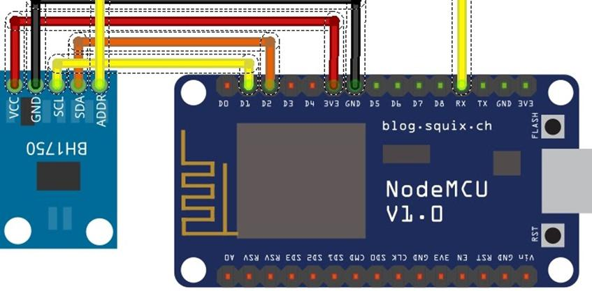
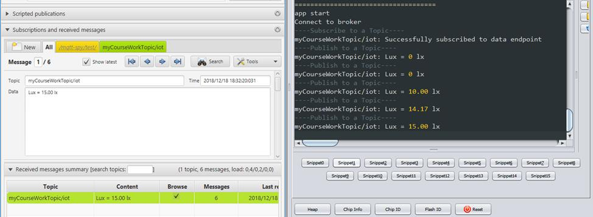
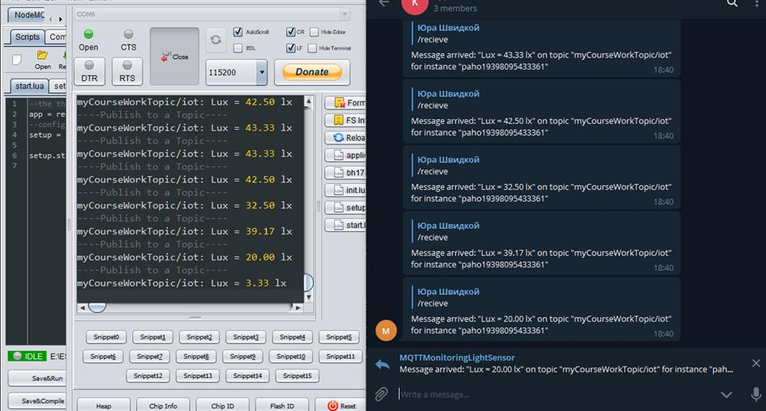
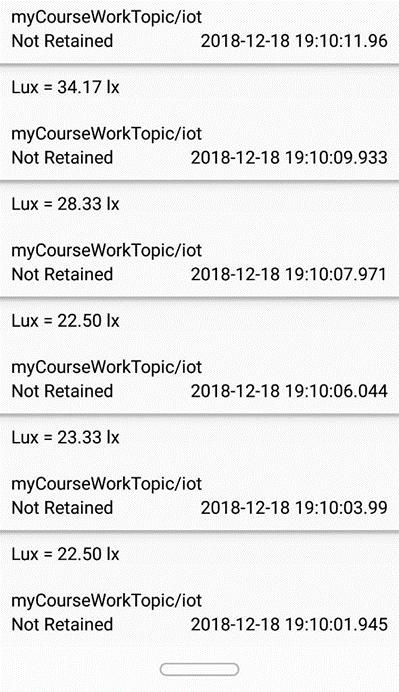

# ESP8266_MQTT
Sending data from BH1750 sensor via esp8266 via MQTT 
## General description of the system
The main idea in setting up remote monitoring data from the BH1750 illumination sensor using the esp8266 microcontroller through the MQTT protocol and displaying this data on different client devices. As a publisher, i will be using the wifi-module esp8266 itself (publishing data from the sensor), and our subscribers will be represented by the Android application, the Telegram bot and the desktop GUI, the mqtt-spy tool (get sensor data).
~~~
The general algorithm of the system is as follows:
1.Customers connect to the broker (server) and immediately , after the connection , each of them subscribes to a specific topic.
2.All communication between clients is transited through a broker, which redirects the data to other clients, taking into account their subscriptions.
~~~
## Hardware
The hardware of our project includes:
* NodeMcu V3 Lua WiFi module based on ESP8266 chip (ESP-12E version)
* Digital GY-302 Light Sensor on BH1750 chip
* Set of jumpers (mom-daddy). 5 pcs
## Firmware
NodeMCU library modules used in the program.

## Let's move on to integration
The BH1750 interacts with another device using the i2c bus. By default, the BH1750 is 0x23 (if you specify the ADDR port on the GND or leave it unattached). Therefore, in order to communicate with the NodeMCU, we must connect the SDA ports (for data exchange) and the SCL (for transmitting the clock signal) BH1750 with the ports of the i2c D2, D1 interface, respectively. Connection scheme:

## Software implementation
To write and load scripts, i will use the ESPlorer program. 
###  Structure of the LuA project
Since the project does not take much space, but it has a rather complicated structure, we will adhere to good practices and divide the responsibilities of the program into several files:
* The start.lua file, which is the logon point in our program and connects, loads the project modules.
* the setup.lua file is responsible for setting up the WiFi connection.
* application.lua file will contain app logic
* The bh1750.lua file contains the code that is responsible for receiving data from the bh1750 sensor.
* the init.lua file, starts automatically after the NodeMCU is started, to check that the card is functioning.

This partition has the advantage of having different code blocks installed in different files, which makes it much easier to recompile only the files that we need.

<b>Setup.lua</b>-Connect to Wifi. The Wi-Fi configuration is easy enough, we pass through all available Access Points using the loop, and if we find the SSID - we will try to connect with our password. Timer functions tmr.alarm () and tmr.stop () are the recommended way to run the code (in this case, the wifi_wait_ip () function at certain intervals, since it is not blocked, we safely check the connection to the Wifi point.

<b>bh1750.lua</b>-Connecting the sensor, obtaining data from the photodiode. The BH1750 has different modes of measurement - low resolution mode - (4 lx accuracy, 16 ms measurement time), high-resolution mode - (1 lx accuracy, 120 ms measurement), high-resolution mode 2 - (accuracy of measurement 0.5 lx, measuring time 120 ms). Unfortunately, I have not found a software way to control sensor modes by means of NodeMcu firmware. But they are well represented in the Arduino library  -(https: //github.com/claws/BH1750). If you need to work with sensor modes, we must already use the tools of this API.

<b>Application.lua</b>-Our main code. The implementation process is as follows:
* Creating Mqtt Client.
* Creating a callback function for receiving messages.
* Connecting to a broker.
* Subscribe to topic myCourseWorkTopic / iot for receiving messages
* Setting periodic data acquisition in suites from the sensor, for further publication on the given topic myCourseWorkTopic / iot.
## Testing 
MQTTSpy for testing without writing the application itself.
First, we will connect our NodeMcu to ESPlorer to see the result on the console. Then use MQQTSpy and connect to iot.eclipse.org:1883 broker to subscribe to topic myCourseWorkTopic / iot.
We see how incoming messages about measurements of illumination by the sensor from our microcontroller to our client Mqtt.

An excellent variant for the client's implementation turned out to be the bot for the Telegram messenger. Telegram has applications on all major platforms as well as the web version. You can access it from anywhere, just have an account.

Android application(Mqtt-Client) on which the Mqtt Client was deployed and tested.

